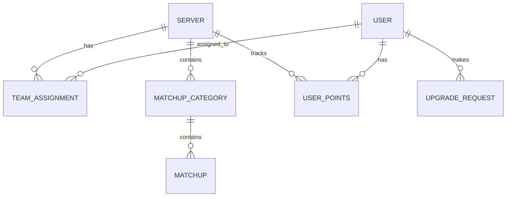
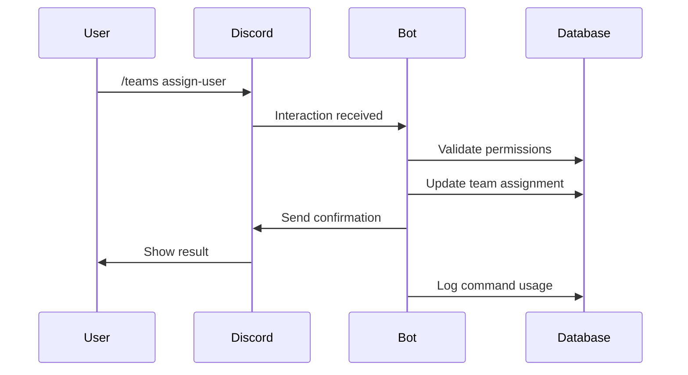

# 🏗️ Trilo Bot Architecture

This document provides a detailed overview of the Trilo Discord bot's architecture, design patterns, and technical implementation.

## 📋 Table of Contents

- [System Overview](#system-overview)
- [Database Architecture](#database-architecture)
- [Command Structure](#command-structure)
- [Event Handling](#event-handling)
- [Security & Privacy](#security--privacy)
- [Performance & Scalability](#performance--scalability)
- [Development Workflow](#development-workflow)

## 🎯 System Overview

Trilo is built as a modular Discord bot using Python and discord.py, designed to handle multiple servers and thousands of users efficiently.

### Core Components

```
┌─────────────────┐    ┌─────────────────┐    ┌─────────────────┐
│   Discord API   │◄──►│   Trilo Bot     │◄──►│   SQLite DBs    │
└─────────────────┘    └─────────────────┘    └─────────────────┘
                              │
                              ▼
                       ┌─────────────────┐
                       │  Streamlit App  │
                       │  (Ability Lab)  │
                       └─────────────────┘
```

### Key Design Principles

- **Modularity**: Each feature is self-contained in its own module
- **Scalability**: Database design supports multiple servers and users
- **Privacy**: Minimal data collection with automatic cleanup
- **Reliability**: Comprehensive error handling and logging
- **Maintainability**: Clear separation of concerns and documentation

## 🗄️ Database Architecture

Trilo uses a multi-database approach with SQLite for optimal performance and simplicity.

### Database Schema

#### `trilo_teams.db` - Team Management
```sql
-- CFB Teams
CREATE TABLE cfb_teams (
    id INTEGER PRIMARY KEY,
    team_name TEXT NOT NULL,
    team_key TEXT UNIQUE NOT NULL,
    user_id TEXT,
    server_id TEXT,
    assigned_at TIMESTAMP DEFAULT CURRENT_TIMESTAMP
);

-- NFL Teams (similar structure)
CREATE TABLE nfl_teams (...);
```

#### `trilo_matchups.db` - Matchup System
```sql
-- Matchup Categories
CREATE TABLE matchup_categories (
    id INTEGER PRIMARY KEY,
    server_id TEXT NOT NULL,
    category_name TEXT NOT NULL,
    is_public BOOLEAN DEFAULT FALSE,
    created_at TIMESTAMP DEFAULT CURRENT_TIMESTAMP
);

-- Individual Matchups
CREATE TABLE matchups (
    id INTEGER PRIMARY KEY,
    category_id INTEGER,
    team1_name TEXT NOT NULL,
    team2_name TEXT NOT NULL,
    game_status TEXT DEFAULT 'pending',
    created_at TIMESTAMP DEFAULT CURRENT_TIMESTAMP
);
```

#### `trilo_attributes.db` - Point System
```sql
-- User Points
CREATE TABLE attribute_points (
    id INTEGER PRIMARY KEY,
    user_id TEXT NOT NULL,
    server_id TEXT NOT NULL,
    points INTEGER DEFAULT 0,
    last_updated TIMESTAMP DEFAULT CURRENT_TIMESTAMP
);

-- Upgrade Requests
CREATE TABLE attribute_requests (
    id INTEGER PRIMARY KEY,
    user_id TEXT NOT NULL,
    server_id TEXT NOT NULL,
    player_name TEXT NOT NULL,
    upgrade_type TEXT NOT NULL,
    status TEXT DEFAULT 'pending',
    requested_at TIMESTAMP DEFAULT CURRENT_TIMESTAMP
);
```

#### `trilo_keys.db` - Subscription Management
```sql
-- Server Subscriptions
CREATE TABLE server_subscriptions (
    id INTEGER PRIMARY KEY,
    server_id TEXT UNIQUE NOT NULL,
    subscription_type TEXT NOT NULL,
    expires_at TIMESTAMP,
    trial_used BOOLEAN DEFAULT FALSE,
    created_at TIMESTAMP DEFAULT CURRENT_TIMESTAMP
);
```

### Database Relationships



## 🎮 Command Structure

Trilo uses Discord's slash command system with a hierarchical structure.

### Command Organization

```
/trilo (root group)
├── help - Comprehensive help system
└── [feature-specific commands]

/admin (admin group)
├── trial - Start free trial
├── purchase - View premium plans
├── setup-league - Initialize league
└── guide - Setup walkthrough

/teams (team management)
├── assign-user - Assign user to team
├── unassign-user - Remove user assignment
├── list-all - View all assignments
└── who-has - Check team ownership

/matchups (matchup automation)
├── create - Generate matchups
├── cfb-create-from-image - Create from schedule
├── tag-users - Auto-tag participants
└── sync-records - Update records

/attributes (point system)
├── give - Award points
├── request - Request upgrade
├── approve-request - Approve upgrade
└── check-user - View user points
```

### Command Implementation Pattern

```python
def setup_feature_commands(bot: commands.Bot):
    feature_group = app_commands.Group(name="feature", description="Feature description")
    
    @feature_group.command(name="command", description="Command description")
    @app_commands.describe(param="Parameter description")
    @log_command("feature command")
    async def command_function(interaction: discord.Interaction, param: str):
        # Command implementation
        pass
    
    bot.tree.add_command(feature_group)
```

## 🔄 Event Handling

Trilo implements a comprehensive event handling system for Discord events.

### Core Events

```python
# Bot lifecycle
async def on_ready():
    # Initialize bot, sync commands, setup logging

async def on_guild_join(guild):
    # Send welcome message, initialize server data

async def on_member_remove(member):
    # Clean up user data, remove assignments

# Message handling
async def on_message(message):
    # Process slash commands, handle interactions

# Reaction handling
async def on_raw_reaction_add(payload):
    # Handle matchup reactions, game status updates
```

### Event Flow



## 🔒 Security & Privacy

### Data Protection

- **Minimal Collection**: Only essential data is stored
- **Hashing**: User and server IDs are hashed for privacy
- **Local Storage**: All data stored locally in encrypted databases
- **Automatic Cleanup**: Logs automatically deleted after 30 days

### Permission System

```python
# Role-based access control
@admin_only()
async def admin_command(interaction):
    # Only server admins can execute

@commissioner_only()
async def commissioner_command(interaction):
    # Only designated commissioners can execute
```

### Privacy Compliance

- **GDPR Compliant**: EU data protection regulations
- **Discord ToS Compliant**: Follows Discord's developer terms
- **Transparent**: Clear privacy policy and data usage
- **User Control**: Users can request data deletion

## ⚡ Performance & Scalability

### Optimization Strategies

1. **Database Indexing**: Optimized queries with proper indexes
2. **Connection Pooling**: Efficient database connection management
3. **Command Logging**: Async logging to prevent blocking
4. **Error Handling**: Graceful degradation on failures
5. **Caching**: In-memory caching for frequently accessed data

### Scalability Considerations

- **Multi-Server Support**: Each server operates independently
- **Database Sharding**: Separate databases for different data types
- **Async Operations**: Non-blocking I/O operations
- **Resource Management**: Automatic cleanup and maintenance

### Performance Monitoring

```python
# Command execution tracking
@log_command("command_name")
async def command_function(interaction):
    start_time = time.time()
    # Command logic
    execution_time = time.time() - start_time
    # Log performance metrics
```

## 🛠️ Development Workflow

### Code Organization

```
src/
├── bot.py              # Main bot class
├── events/             # Event handlers
│   ├── messages.py     # Message handling
│   └── reactions.py    # Reaction handling
└── utils/              # Utility functions
    ├── command_logger.py
    ├── entitlements.py
    └── utils.py

commands/               # Command modules
├── admin.py           # Admin commands
├── teams.py           # Team management
├── matchups.py        # Matchup automation
└── ...

config/                # Configuration
├── database.py        # Database config
└── settings.py        # Bot settings

data/                  # Data management
├── databases/         # SQLite files
└── scripts/           # Management scripts
```

### Testing Strategy

1. **Unit Tests**: Individual function testing
2. **Integration Tests**: Command flow testing
3. **Performance Tests**: Load and stress testing
4. **User Acceptance**: Real-world usage testing

### Deployment Process

1. **Development**: Local testing with dev token
2. **Staging**: Test server with production-like setup
3. **Production**: Live deployment with monitoring
4. **Monitoring**: Continuous performance tracking

## 📊 Analytics & Monitoring

### Command Analytics

- **Usage Patterns**: Most popular commands and features
- **Performance Metrics**: Execution times and success rates
- **Error Tracking**: Failed commands and error types
- **User Engagement**: Active users and feature adoption

### Database Analytics

- **Growth Tracking**: User and server growth over time
- **Storage Optimization**: Database size and cleanup efficiency
- **Query Performance**: Slow query identification and optimization

### Business Metrics

- **Subscription Analytics**: Trial conversions and retention
- **Feature Adoption**: Pro feature usage patterns
- **User Satisfaction**: Error rates and support requests

## 🔮 Future Enhancements

### Planned Features

- **Multi-Sport Support**: Expand beyond football
- **Advanced Analytics**: Machine learning insights
- **API Integration**: Third-party service connections
- **Mobile App**: Companion mobile application

### Technical Improvements

- **Microservices**: Break into smaller services
- **Cloud Deployment**: Move to cloud infrastructure
- **Real-time Updates**: WebSocket connections
- **Advanced Caching**: Redis integration

---

This architecture document provides a comprehensive overview of Trilo's technical implementation. For specific implementation details, refer to the individual source files and inline documentation.
