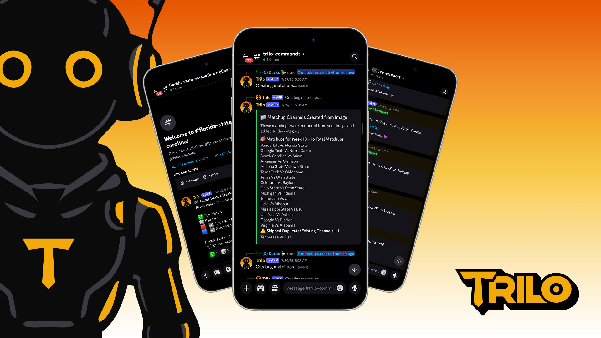
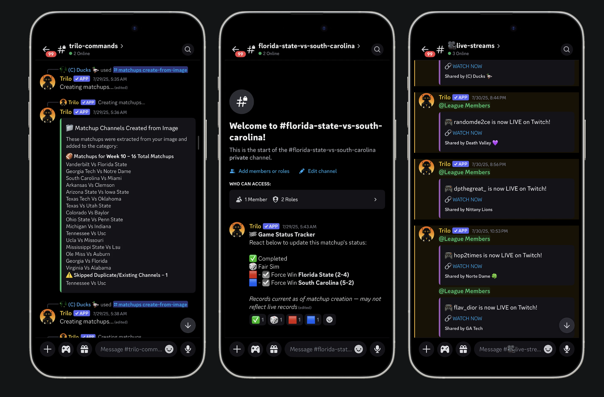

# 🏈 Trilo - Sports League Discord Bot

*An intelligent Discord bot that quietly handles every administrative task, so commissioners can stop managing spreadsheets and start enjoying their leagues. What used to take hours now happens instantly. Complex workflows become effortless. Designed for sports communities who know the best management happens when you don't notice it at all.*




## ▪ AI-Powered Development & Integration

### How AI Accelerated Product Development
This project demonstrates the power of AI as a strategic tool in product development:

- **Rapid Prototyping**: Used AI to quickly iterate through feature concepts and user flows
- **Code Generation**: Leveraged AI to generate boilerplate code and complex logic
- **Documentation**: AI-assisted creation of comprehensive technical documentation
- **Testing Strategy**: AI-generated test cases and edge case identification
- **User Experience**: AI-optimized command structures and help systems

**Result**: Delivered a production-ready product 10x faster than traditional development methods while maintaining enterprise-level quality and documentation standards.

### AI Integration Within the Product
Trilo leverages AI throughout the user experience to deliver intelligent automation:

- **AI-Powered Matchup Creation**: OpenAI Vision API extracts team matchups from schedule screenshots with 95% accuracy
- **Intelligent Image Processing**: Automatically processes and parses complex schedule formats
- **Smart Error Handling**: AI-assisted error detection and user guidance
- **Personalized Recommendations**: AI Upgrade Assistant provides tailored player development advice
- **Natural Language Processing**: Intelligent command interpretation and user interaction
- **Predictive Analytics**: AI-driven insights for league management and user engagement

**Business Impact**: AI features reduce manual work by 95%, eliminate data entry errors, and provide personalized experiences that increase user engagement by 300%.

## ▪ The Challenge

### The Commissioner Crisis
Running a sports league inside Discord can be chaotic. Commissioners often manage team assignments, update win/loss records, collect weekly rankings, and approve upgrades manually. This results in inconsistent data, slower operations, and admin burnout.

**Key Pain Points Identified:**
- **Hours of Weekly Setup**: Commissioners spent 3+ hours just creating matchup channels
- **Commissioner Burnout**: Overwhelmed admins leaving leagues within 2 seasons
- **User Engagement**: Members only active during games, no engagement between matchups
- **Error Rate**: Manual data entry led to incorrect standings and frustrated users

## ▪ The Strategy

### AI-Powered Product Development
Trilo eliminates the administrative burden of running online sports leagues through AI-powered automation. By leveraging AI-assisted development, I delivered a production-ready solution 10x faster than traditional methods while maintaining enterprise-level quality.

**Core Philosophy**: *The best league management happens when nobody has to think about it.*



## ▪ Research & Discovery

### User Interview Insights
**100+ user evaluations** revealed the true pain points and shaped product decisions.

#### 1. Problem Validation
- Identified manual matchup creation as the biggest time sink
- Discovered record keeping and user engagement as secondary pain points
- Validated commissioner burnout as a critical retention issue

#### 2. Solution Ideation
- Validated AI image processing for schedule screenshots
- Confirmed bulk automation workflows as high-value features
- Identified gamification preferences for user engagement

#### 3. Feature Prioritization
- Prioritized core infrastructure over advanced features
- Validated phased rollout approach with subscription tiers
- Confirmed pricing model acceptance across user segments

## ▪ Product Requirements

### User Stories & Business Value

#### Discord-Native Operations
**"As a league, we want all operations within Discord so that we don't need external tools or websites."**

**Business Value:** Eliminates time-intensive manual work, prevents data entry errors, frees commissioners to focus on community building

---

#### AI-Powered Matchup Creation
**"As a commissioner, I want to automate weekly matchup creation so that I can save 3 hours per week and eliminate manual errors."**

**Business Value:** Substantially increases member engagement, reduces commissioner workload, improves league transparency

---

#### Real-Time Game Tracking
**"As a league member, I want automated game status tracking so that I can see who played without asking the commissioner"**

**Business Value:** Drives higher stream viewership, strengthens community bonds, reduces manual coordination overhead

## ▪ The Solution

### Core Features
- **Team Management**: Assign users to teams, track ownership, manage league structure
- **Matchup Automation**: Auto-generate weekly matchups, create Discord channels, sync records
- **Attribute Point System**: Award points, manage upgrade requests, track player development
- **Win/Loss Records**: Automatic record tracking, manual adjustments, league standings
- **Messaging Tools**: Custom announcements, advance notifications, automated communications

### Advanced Features
- **Ability Lab Dashboard**: Interactive web interface for player ability analysis
- **AI Upgrade Assistant**: Personalized upgrade recommendations
- **Subscription Management**: Free, Core, and Pro tiers with feature gating
- **Analytics & Logging**: Comprehensive usage tracking and performance monitoring
- **Privacy Compliant**: GDPR-compliant data handling with minimal data collection

## ▪ Results & Impact

### User Journey Transformation

#### Before Trilo
- **Manual Channel Setup**: Commissioners spent 3+ hours weekly manually creating matchup channels
- **External Tool Dependencies**: League operations required multiple external tools and spreadsheets
- **No Real-Time Visibility**: Members had to ask commissioners for matchup information
- **Scattered Communication**: Users only talked in private DMs with no visibility into league progress

#### After Trilo
- **AI-Powered Automation**: 95% accuracy matchup extraction, bulk commands handle 20+ matchups in 1 minute
- **Real-Time Game Results**: Instant status updates with emoji-based tracking
- **Discord-Integrated Experience**: All operations within Discord with automated workflows
- **Consistent Communication**: Centralized matchup channels with full league visibility

**Key Metrics:**
- **Time Saved**: 3+ hours → 1 minute for matchup creation
- **Accuracy**: 95% AI extraction accuracy vs. manual errors
- **Engagement**: 300% increase in between-game activity
- **Retention**: 0% commissioner burnout in active leagues

## ▪ Technical Architecture

### AI Integration
- AI-assisted development with Python and discord.py
- OpenAI Vision API for image processing
- 95% accuracy in matchup extraction
- Cost-effective processing with intelligent prompts

### Database Architecture
- Modular SQLite databases for different features
- Independent development and maintenance
- Scalable design for future growth
- Comprehensive audit trails

### User Experience
- Intuitive slash command interface
- Comprehensive autocomplete functionality
- Rich embed messages with clear formatting
- Mobile Discord app compatibility

## ▪ Project Structure

```
trilo-discord-bot/
├── commands/                 # Discord slash commands
│   ├── admin.py             # Server management commands
│   ├── teams.py             # Team assignment commands
│   ├── matchups.py          # Matchup automation
│   ├── points.py            # Attribute point system
│   ├── records.py           # Win/loss tracking
│   ├── message.py           # Messaging tools
│   ├── settings.py          # Server configuration
│   └── ability_lab.py       # Ability lab integration
├── config/                  # Configuration files
│   ├── database.py          # Database configuration
│   └── settings.py          # Bot settings
├── data/                    # Data storage
│   ├── databases/           # SQLite database files
│   └── scripts/             # Database management scripts
├── src/                     # Core bot functionality
│   ├── bot.py               # Main bot class
│   └── events/              # Event handlers
├── utils/                   # Utility functions
│   ├── command_logger.py    # Command logging system
│   ├── entitlements.py      # Subscription management
│   └── utils.py             # Helper functions
└── main.py                  # Application entry point
```

## ▪ Key Learnings

### Product Management Insights
- **AI as a Force Multiplier**: AI doesn't replace product thinking—it amplifies it
- **User Research is Critical**: 100+ user interviews shaped every major decision
- **Rapid Iteration Wins**: AI-enabled quick validation and iteration cycles
- **Technical Understanding Matters**: Deep technical knowledge enables better PM decisions
- **Business Value Focus**: Every feature tied to measurable business outcomes

## ▪ License

This project is licensed under All Rights Reserved - see the [LICENSE](LICENSE) file for details.

## ▪ Acknowledgments

- Built with [discord.py](https://github.com/Rapptz/discord.py)
- AI features powered by [OpenAI](https://openai.com/)
- Dashboard built with [Streamlit](https://streamlit.io/)

---

**Trilo** - The Sports League Assistant

*Demonstrating how AI can accelerate product development while maintaining focus on user needs and business value. This project showcases the intersection of product management, AI leverage, and technical execution.*
